*Assignment 1 --- a custom VPC built from scratch, with public and
private subnets, correct internet routing and EC2 instances deployed
across both tiers.*

### 

### 

### 

### ***Objective***

*This assignment focuses on building cloud networking fundamentals from
the ground up: a custom VPC spanning a public and private subnet, with
correct routing for internet access and instances deployed across both
tiers.*

*Success criteria for this assignment:*

-   *A custom VPC (e.g. 10.0.0.0/16) containing one public subnet and
    > one private subnet.*

-   *An Internet Gateway attached to the VPC, and a NAT Gateway (with an
    > Elastic IP) deployed in the public subnet to provide outbound
    > internet access for the private subnet.*

-   *A public route table with a default route (0.0.0.0/0) via the
    > Internet Gateway, and a private route table with a default route
    > via the NAT Gateway.*

-   *A public EC2 instance launched in the public subnet with a public
    > IP, and a private EC2 instance launched in the private subnet with
    > no public IP.*

-   *Security groups configured so the public EC2 instance allows
    > SSH/HTTP only from the administrator\'s IP, while the private EC2
    > instance allows access only from trusted internal sources (e.g.
    > the public EC2 instance or a Bastion host) --- never directly from
    > the internet.*

-   *(Bonus) A Bastion Host deployed to provide secure access into the
    > private EC2 instance, and CloudWatch monitoring enabled on the
    > instances.*

# 

# 

# 

# 

# 

# 

# 

# 

# 

# 

# Planning & Architecture 

Before touching the console, the network was sketched out as a diagram
based on assignment 1 requirements. So the VPC, subnets, gateways and
routing relationships were clear before any resource was actually
created. This diagram gives a high level overview of the architecture,
finer details are covered in the surrounding text.

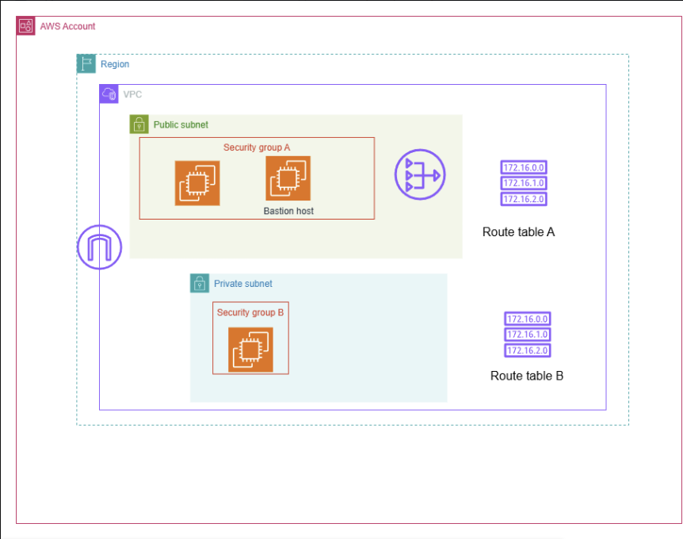{width="7.0in" height="5.527777777777778in"}

*Figur 0*

# 1. Creating the VPC

The VPC was the first resource created, with everything else built on
top of it step by step.

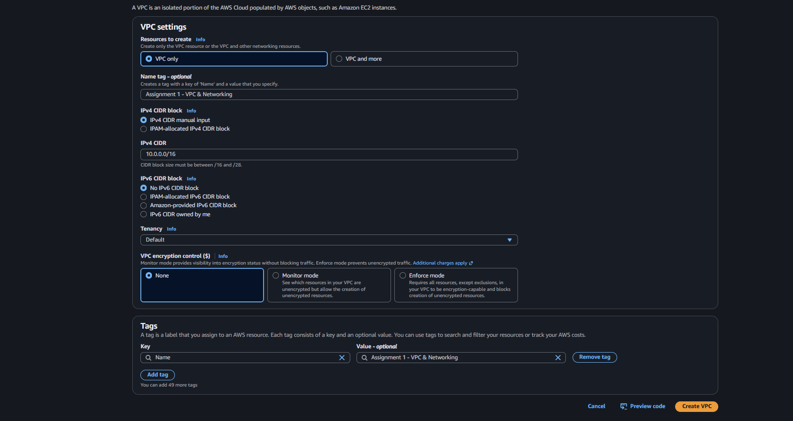{width="5.833333333333333in"
height="3.1041666666666665in"}

*Figur 1*

*VPC creation form --- CIDR block 10.0.0.0/16, Default tenancy, no
encryption control, tagged \"Assignment 1 - VPC & Networking\"*

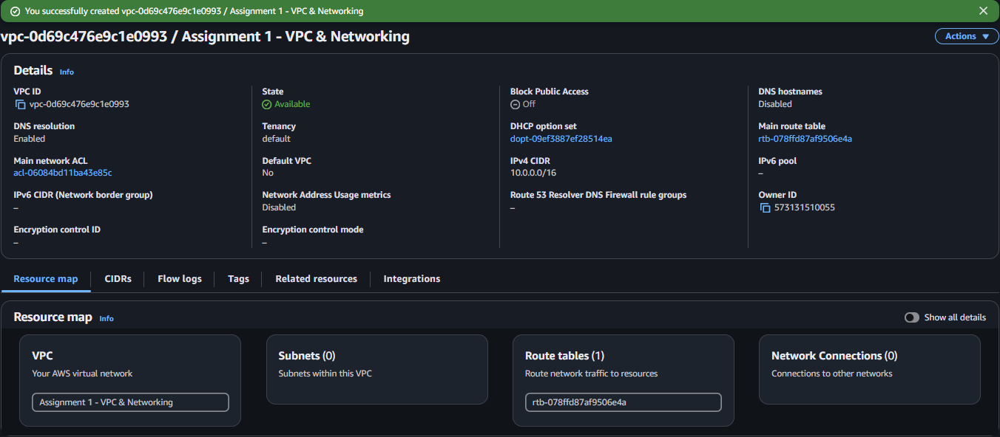{width="5.833333333333333in"
height="2.5520833333333335in"}

*Figur 2*

*VPC created successfully --- resource map showing the new VPC with no
subnets or gateways yet*

# 2. Creating the Public Subnet

The public subnet was created first; the private subnet was planned to
follow the same process, differing only in its route table.

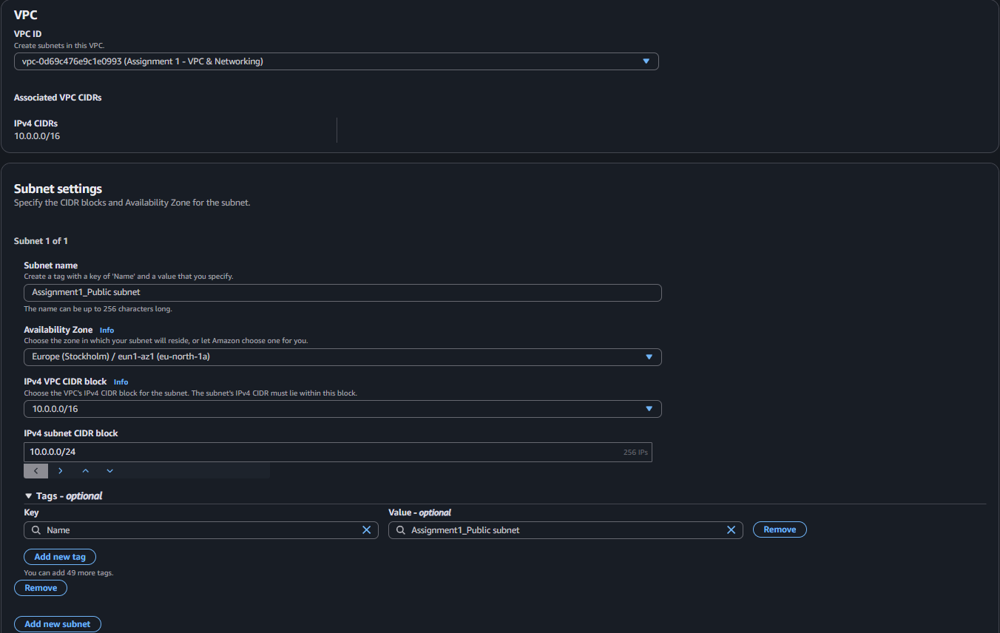{width="5.833333333333333in"
height="3.6979166666666665in"}

*Figur 3*

*Public subnet creation --- Assignment1_Public subnet, 10.0.0.0/24,
eu-north-1a*

A /24 block provides 256 addresses, but AWS reserves 5 of them (network
address, VPC router, DNS, a future-use reservation, and the broadcast
address), leaving 251 usable addresses --- from 10.0.0.4 to 10.0.0.254.

# 3. Private Subnet --- CIDR Planning

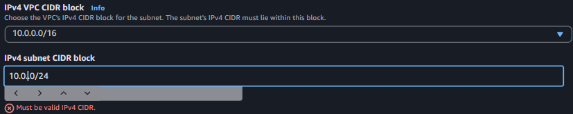{width="5.833333333333333in"
height="1.1666666666666667in"}

*Figur 4*

*Initial attempt to reuse 10.0.0.0/24 for the private subnet ---
rejected as an invalid/overlapping CIDR*

This produced a useful lesson: since the VPC is a /16, the first two
octets (10.0) are fixed, but the third octet is free to choose per
subnet. Reusing 10.0.0.0/24 for a second subnet meant asking for the
exact same 256 addresses already claimed by the public subnet --- a full
overlap, not a partial one. Changing the third octet gives a completely
separate, non overlapping /24 block within the same /16 VPC. IP range
10.0.7.4 to 10.0.7.254.

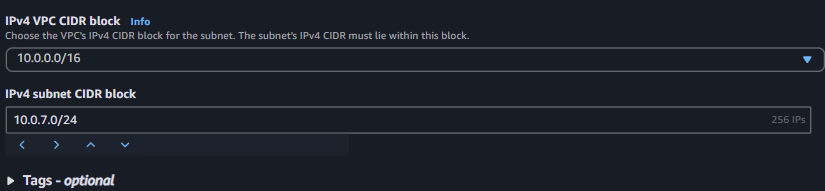{width="5.833333333333333in"
height="1.3541666666666667in"}

*Figur 5*

*Corrected private subnet CIDR --- 10.0.7.0/24, a distinct block within
the 10.0.0.0/16 VPC*

# 4. Internet Gateway

An Internet Gateway is what allows two way traffic between the VPC and
the internet, for any resource that has a public or Elastic IP.

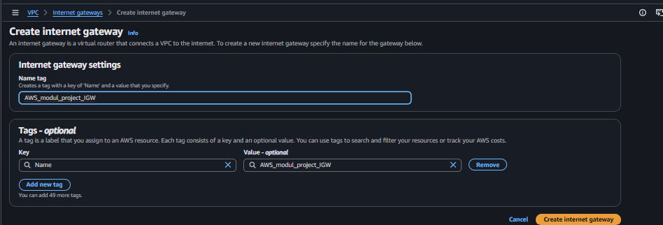{width="5.833333333333333in"
height="1.9791666666666667in"}

*Figur 6*

*Creating the Internet Gateway --- AWS_modul_project_IGW*

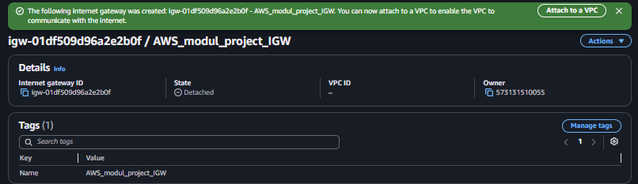{width="5.833333333333333in" height="1.6875in"}

7

*Internet Gateway created --- initial state: Detached*

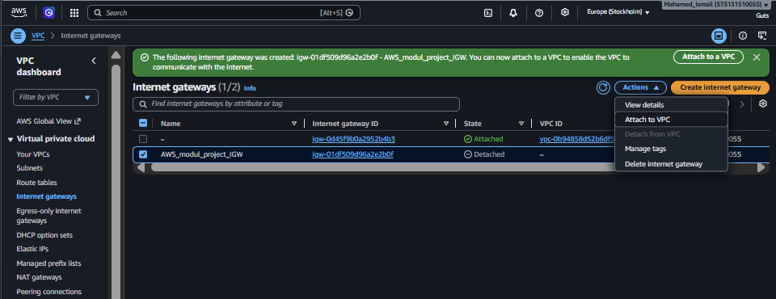{width="5.833333333333333in" height="2.25in"}

*Figur 8*

*Attaching the Internet Gateway to the VPC*

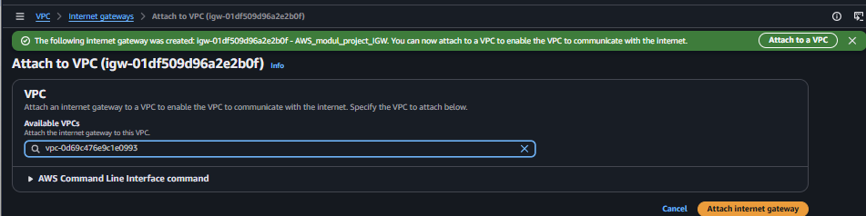{width="5.833333333333333in"
height="1.4583333333333333in"}

*Figur 9*

*Selecting the VPC to attach the Internet Gateway to*

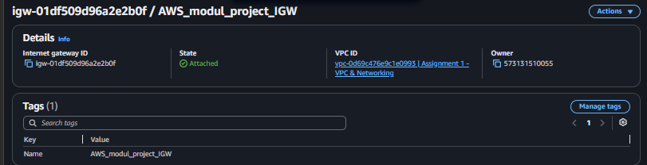{width="5.833333333333333in" height="1.5in"}

10

*Internet Gateway confirmed Attached to the VPC*

# 5. Elastic IP

An Elastic IP was allocated to give the NAT Gateway a fixed public
address to use when sending traffic out to the internet on behalf of the
private subnet.

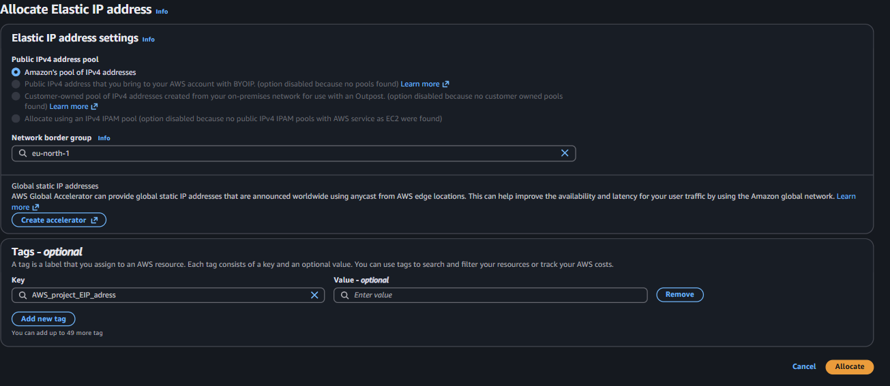{width="5.833333333333333in" height="2.53125in"}

*Figur 11*

*Allocating an Elastic IP address (Zonal, matching the region\'s network
border group)*

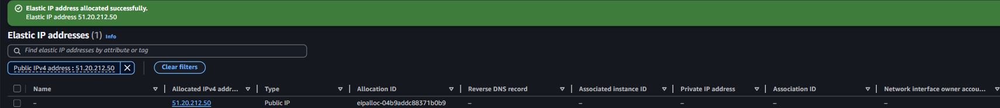{width="5.833333333333333in"
height="0.6354166666666666in"}

*Figur 12*

*Elastic IP successfully allocated*

# 6. NAT Gateway

The NAT Gateway sits in the public subnet and acts as a router for the
private instances: when a private EC2 reaches out to the internet, the
NAT Gateway translates its private IP to the NAT Gateway\'s own private
IP and the Internet Gateway then translates that address to the NAT
Gateway\'s public Elastic IP. A Zonal scope was used since this project
doesn\'t need to scale across multiple Availability Zones.

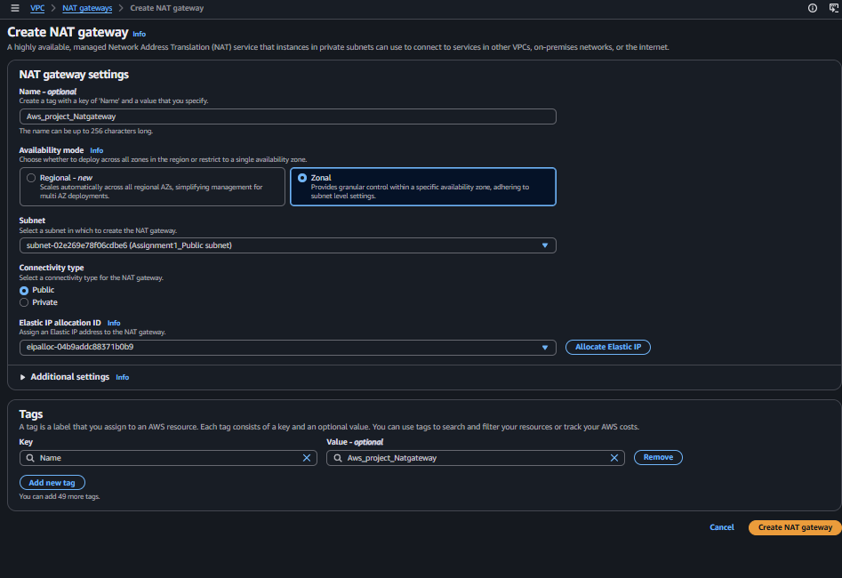{width="5.833333333333333in" height="4.0in"}

*Figur 13*

*Creating the NAT Gateway --- Zonal, in the public subnet, with the
allocated Elastic IP attached*

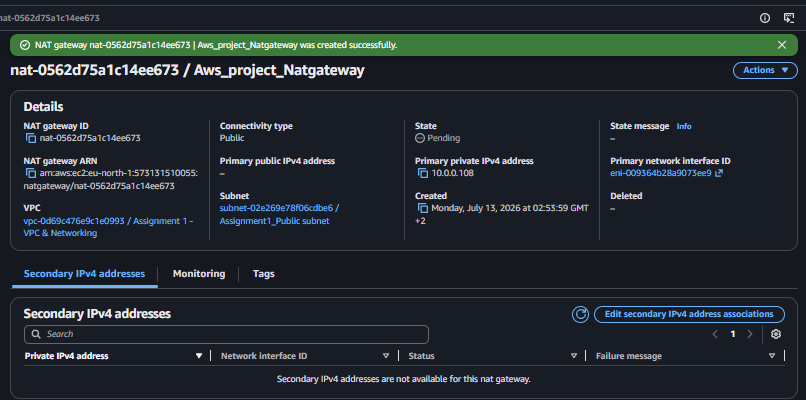{width="5.833333333333333in"
height="2.8958333333333335in"}

*Figur 14*

*NAT Gateway created --- Aws_project_Natgateway, status Pending →
Available*

# 7. Route Tables

A route table was created for the public subnet, to control how traffic
is routed to and from the internet.

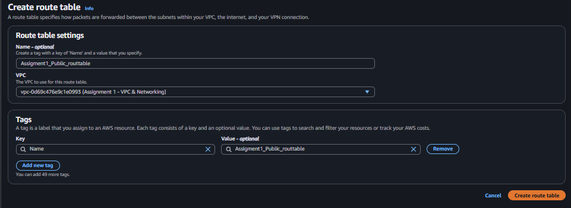{width="5.833333333333333in"
height="2.1354166666666665in"}

*Figur 15*

*Creating the public route table --- Assigmnet1_Public_routtable*

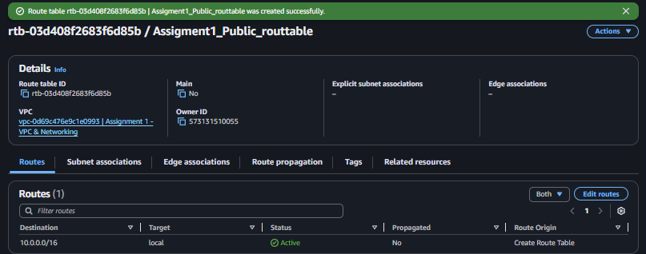{width="5.833333333333333in"
height="2.3020833333333335in"}

*Figur 16*

*Route table created --- only the automatic local route (10.0.0.0/16)
present so far*

## 7.1 Associating the Public Route Table

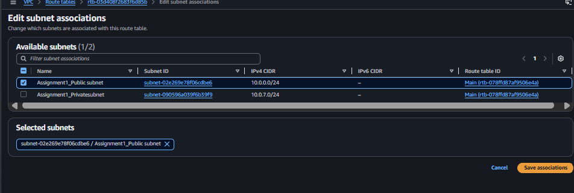{width="5.833333333333333in"
height="1.9583333333333333in"}

*Figur 16*

*Associating the public route table with Assignment1_Public subnet*

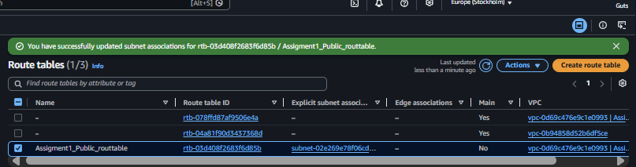{width="5.833333333333333in"
height="1.5416666666666667in"}

*Figur 17*

*Route tables list confirming the public subnet association*

## 7.2 Private Route Table

The same process was repeated for the private subnet, using a separate
route table so its default route could point to the NAT Gateway instead
of the Internet Gateway.

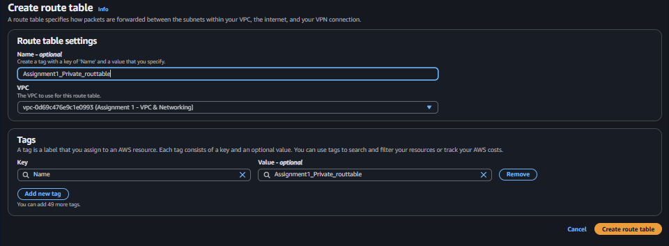{width="5.833333333333333in"
height="2.1458333333333335in"}

*Figur 18*

*Creating the private route table --- Assignment1_Private_routtable*

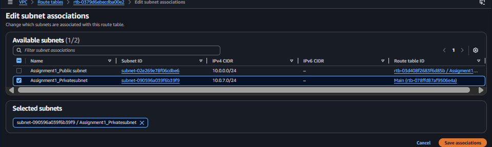{width="5.833333333333333in"
height="1.7395833333333333in"}

*Figur 19*

*Associating the private route table with Assignment1_Privatesubnet*

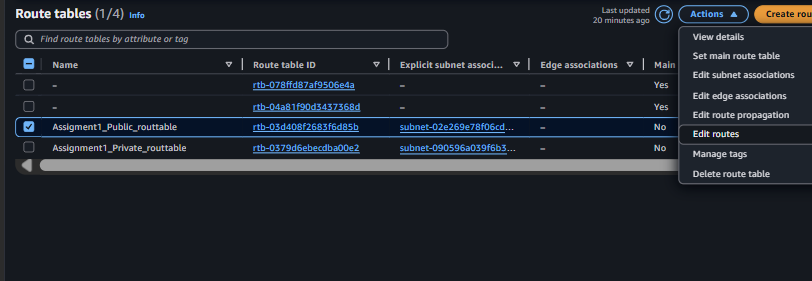{width="5.833333333333333in"
height="2.0208333333333335in"}

*Figur 20*

*Route tables list showing both custom route tables and their subnet
associations*

## 7.3 Public Route Table Rules

A default route (0.0.0.0/0) was added pointing to the Internet Gateway,
so any traffic not destined for the VPC\'s own address range is sent to
the internet from the public subnet.

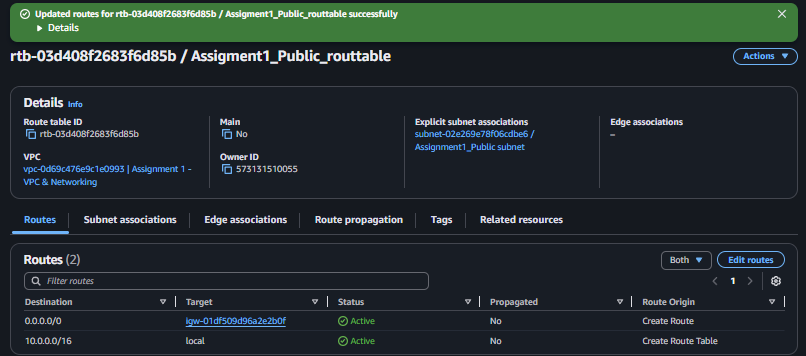{width="5.833333333333333in"
height="2.5729166666666665in"}

*Figur 21*

*Editing routes on the public route table*

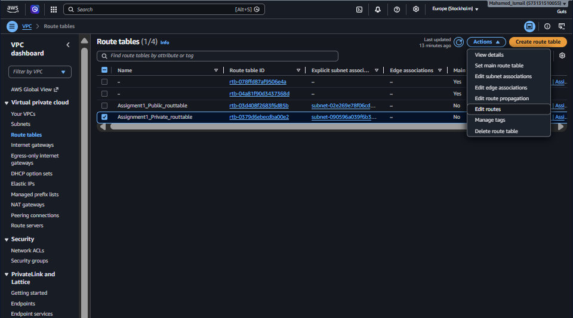{width="5.833333333333333in"
height="3.2395833333333335in"}

*Figur 22*

*Public route table updated --- 0.0.0.0/0 → Internet Gateway, status
Active*

## 7.4 Private Route Table Rules

A default route (0.0.0.0/0) was added pointing to the NAT Gateway,
giving the private subnet safe, outbound only internet access without
exposing it to inbound connections.

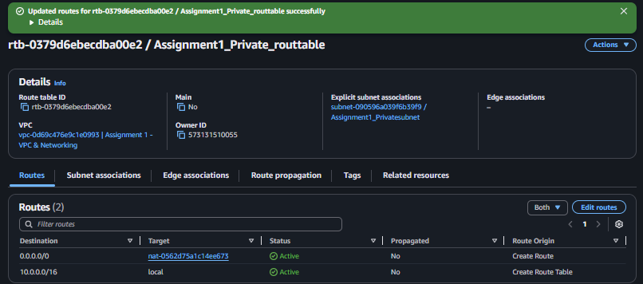{width="5.833333333333333in"
height="2.5729166666666665in"}

*Figur 23*

*Private route table updated --- 0.0.0.0/0 → NAT Gateway, status Active*

# 8. Launching the Public EC2 Instance

With routing in place, the public and private EC2 instances were
launched next. We started with the public one first, since it was gonna
be easier to implement based on our architecture (figure 0).

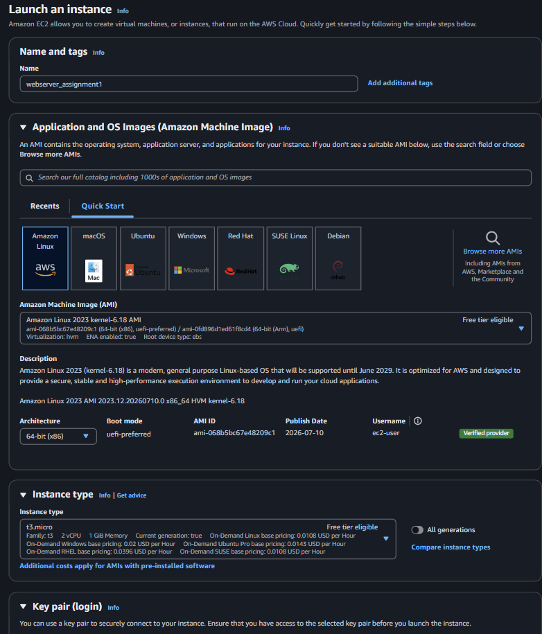{width="5.520833333333333in"
height="6.458333333333333in"}

*Figure 24*

*Launching the public EC2 instance --- Amazon Linux 2023, t3.micro*

All EC2 instances in this project use the smallest available compute
size (t3.micro), both to minimize cost and because the architecture
doesn\'t require significant processing power(Figure 24). Network
settings placed the instance in the custom VPC\'s public subnet with an
auto-assigned public IP enabled and a new Security Group was created
with two inbound rules: SSH (22) and HTTP (80), both restricted to the
admin\'s own IP only(Figure 25). We restricted access to a single IP
address to reduce the attack surface and limit the number of potential
attack sources.

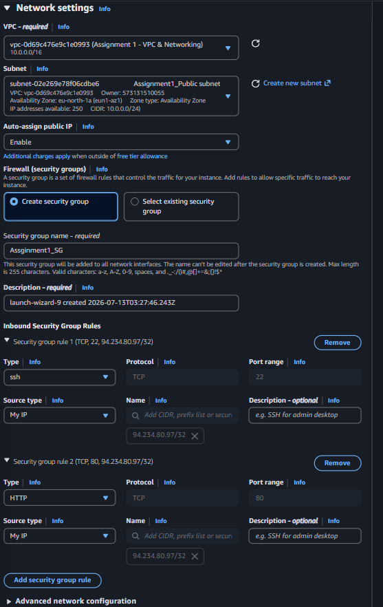{width="4.083333333333333in"
height="6.458333333333333in"}

*Figur 25*

*Network settings for the public EC2 --- Auto-assign public IP: Enable;
inbound rules for SSH and HTTP restricted to My IP*

# 9. Verifying the Public EC2

The instance was tested by connecting over SSH (port 22):

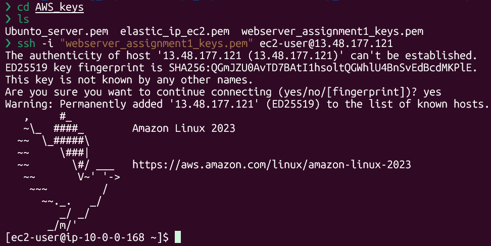{width="5.833333333333333in"
height="2.9270833333333335in"}

*Figur 26*

*Successful SSH connection to the public EC2 instance*

## 9.1 Troubleshooting --- HTTP \"Connection Refused\"

An HTTP request to the instance returned \'connection refused\' rather
than a timeout. This distinction was used to isolate the cause: a
timeout would mean traffic never reached the instance (pointing to the
route table, IGW, Security Group, or NACL), while \'refused\' means the
packet did reach the instance and the OS itself replied that nothing was
listening on that port --- an application-layer issue, not a networking
one. To verify this, I used nc (netcat) to confirm the finding: no
software was installed to answer on port 80, meaning my EC2 had no
process listening on that port --- in other words, no web server was
running.\"

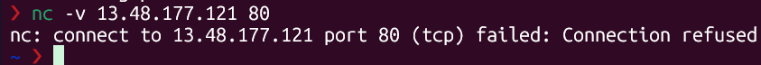{width="5.833333333333333in" height="0.5in"}

*Figur 27*

*Testing port 80 from the local machine with netcat --- connection
refused*

{width="5.833333333333333in"
height="0.4895833333333333in"}

*Figur 28*

*Testing port 80 locally on the instance itself (localhost) --- also
refused, confirming no web server was installed*

This confirmed that the entire network path routing, Security Group, and
NACL was already working correctly and the only missing piece was a web
server actually listening on port 80.

# 10. Bastion Host

A dedicated EC2 instance was launched in the public subnet to act as a
bastion (jump box) for reaching the private instance, rather than
reusing the existing public server.

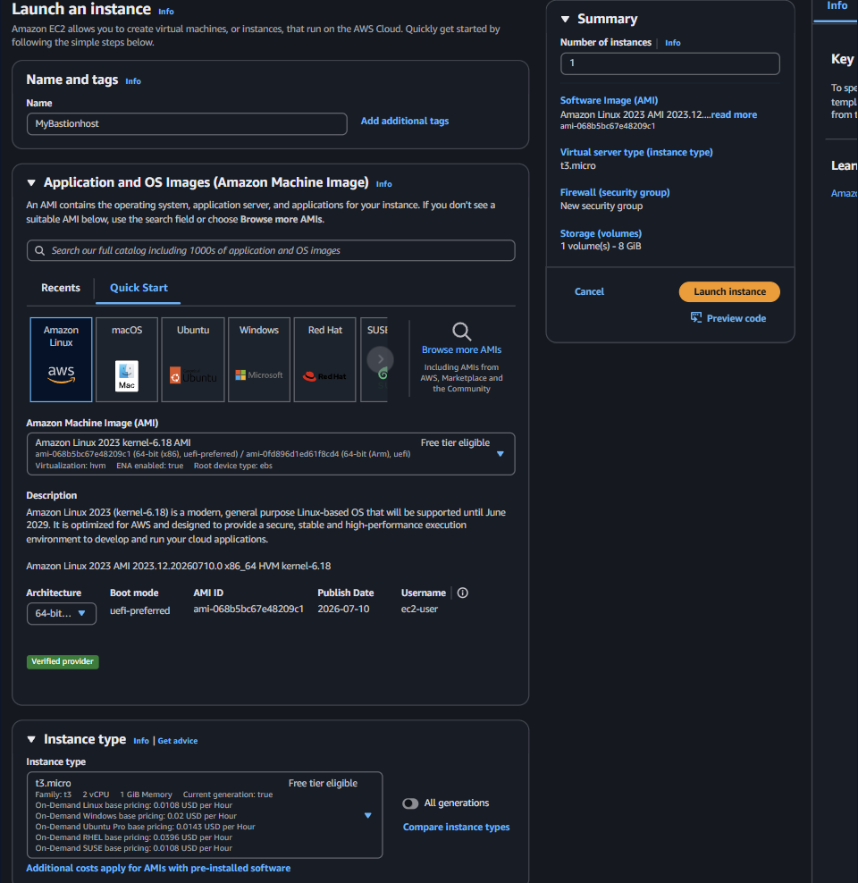{width="5.833333333333333in" height="6.0in"}

*Figur 29*

*Launching the bastion host instance --- MyBastionhost*

Its Security Group only allows SSH (22), restricted to the admin\'s own
IP no HTTP rule added because bastion\'s objective is only secure
connectivity to my private instances.

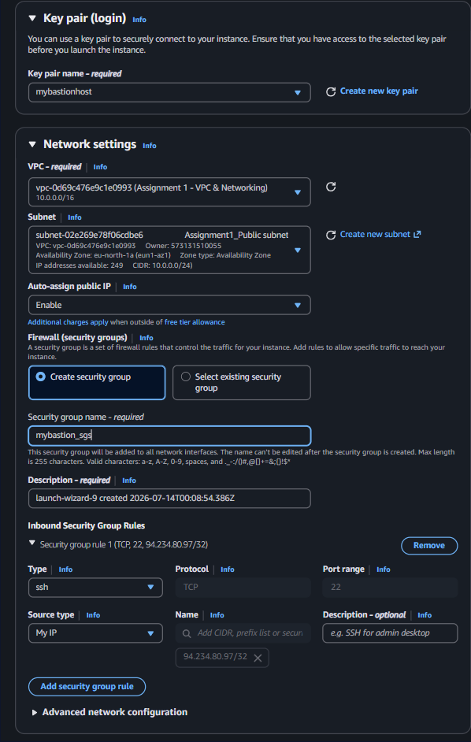{width="4.104166666666667in"
height="6.458333333333333in"}

*Figur 30*

*Bastion host network settings and Security Group --- SSH only, source
My IP*

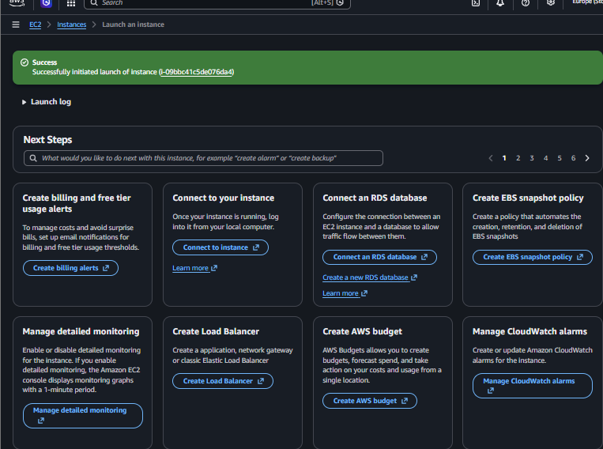{width="5.833333333333333in" height="4.34375in"}

*Figur 30*

*Bastion host launched successfully*

# 11. Launching the Private EC2 Instance

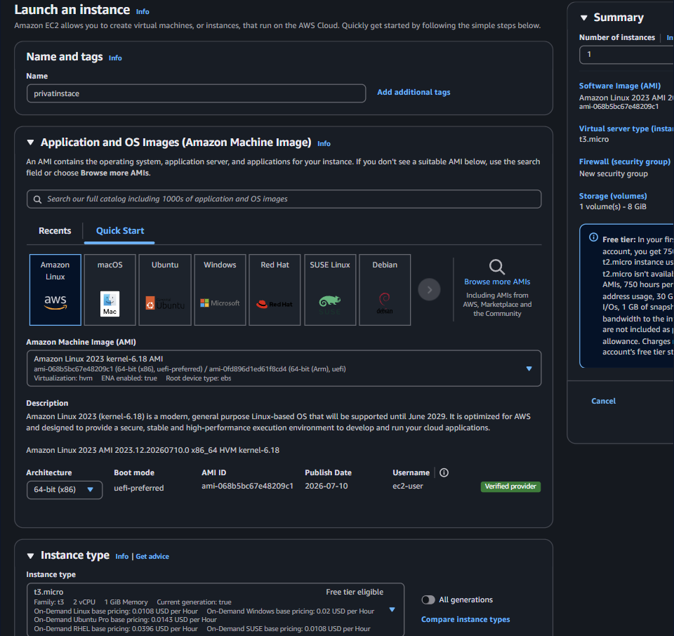{width="5.833333333333333in"
height="5.510416666666667in"}

*Figur 31*

*Launching the private EC2 instance --- privatinstace*

The instance was placed in the private subnet (the one without a route
to the Internet Gateway) with auto-assigned public IP disabled. Its
Security Group allows SSH only from the bastion\'s Security Group ---
referenced by ID rather than by IP --- so the rule stays valid even if
the bastion is ever replaced or its IP changes (for example, after a
reboot), instead of needing to be manually updated each time.

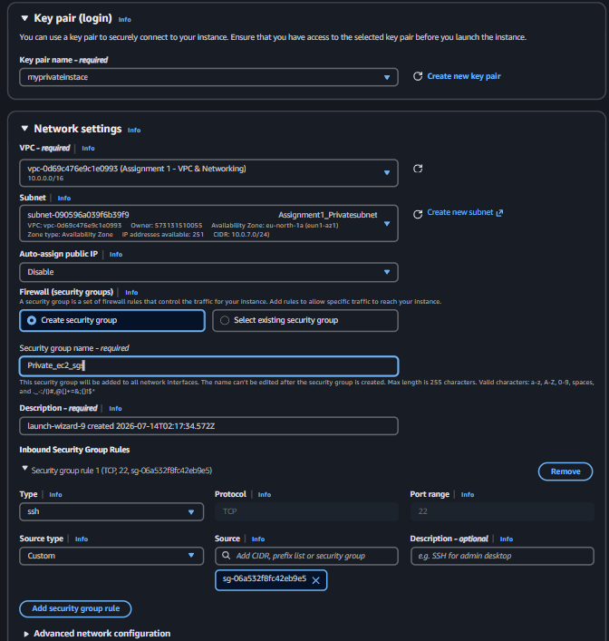{width="5.833333333333333in"
height="6.135416666666667in"}

*Figur 32*

*Private EC2 network settings --- no public IP; Security Group inbound
rule sourced from the bastion\'s Security Group ID*

# 12. Secure Access via SSH Agent Forwarding

Rather than copying the private EC2\'s key onto the bastion host ---
which would leave a sensitive private key sitting on a second machine\'s
disk --- SSH agent forwarding was used instead. This keeps the private
key only on the local machine: the local ssh-agent holds the key in
memory and signs authentication challenges on behalf of the bastion when
it connects onward to the private instance, without the key itself ever
being copied anywhere.

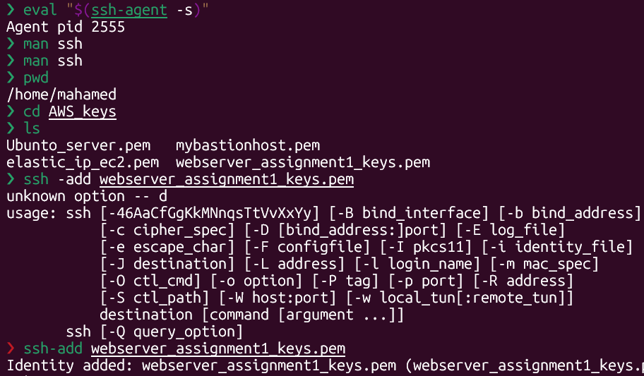{width="5.833333333333333in" height="3.40625in"}

*Figur 33*

*Private EC2 key pair and Security Group configuration*

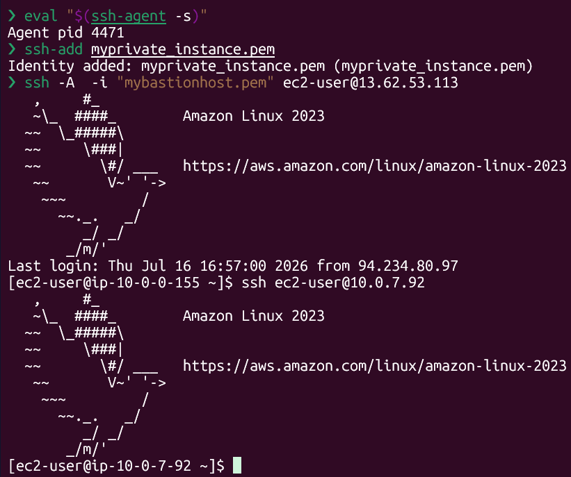{width="5.833333333333333in"
height="4.885416666666667in"}

*Figur 34*

*Loading the private EC2\'s key into the local ssh-agent (ssh-add)*

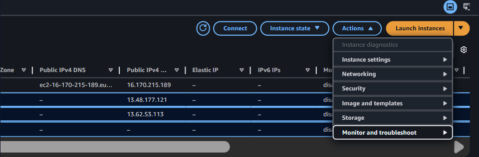{width="5.833333333333333in"
height="1.9166666666666667in"}

*Figur 35*

*Full connection chain: local machine → bastion (with agent forwarding,
-A) → private EC2 (no key file needed on the bastion)*

# 

# Verifying internet access from private instance 

Based o n my architecture, I used nat to safely access the internet by
blocking connections and hiding my instance ip with nat.

I verified internet access with ping 8 8 8 8 this is standard test to
see if device is connected tp the internet i basically send packets to
googles dns servers.

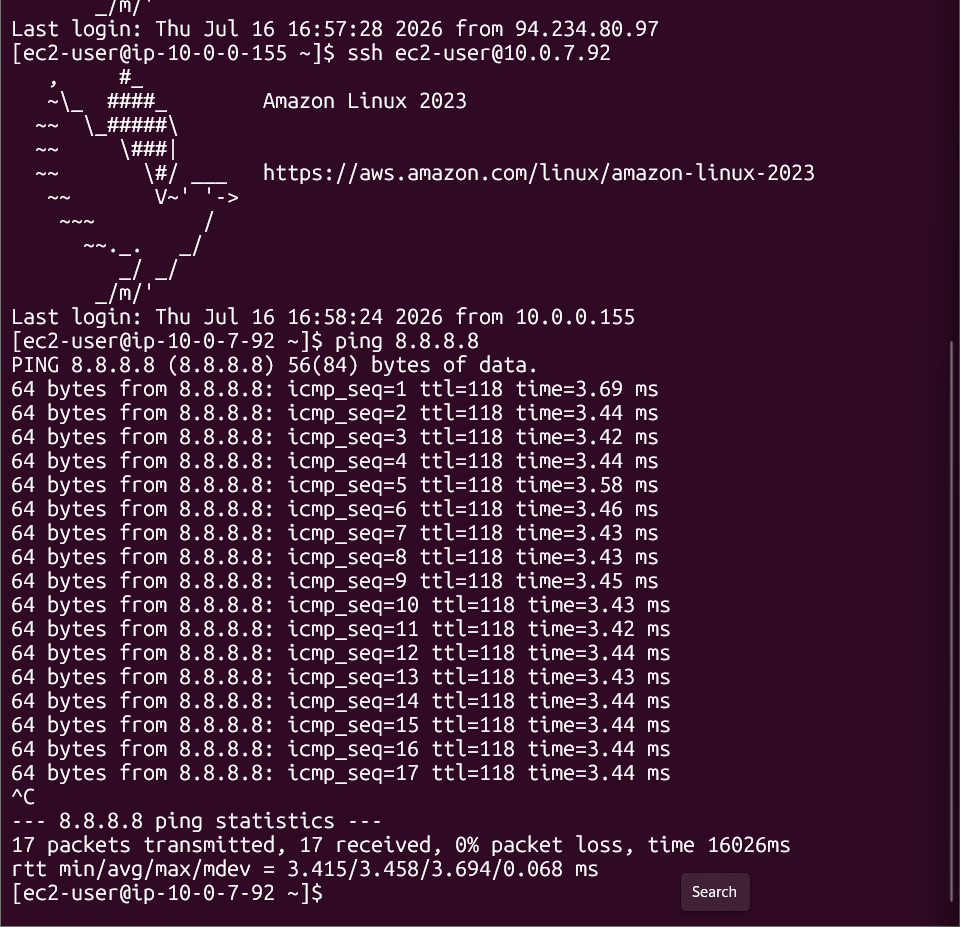{width="5.640625546806649in"
height="5.447567804024497in"}

*Figur 36*

# 

# 

# 

# 

# 

# 

# 

# 

# 

# 13. CloudWatch Monitoring

CloudWatch monitoring was enabled on the instances to track their health
and performance.

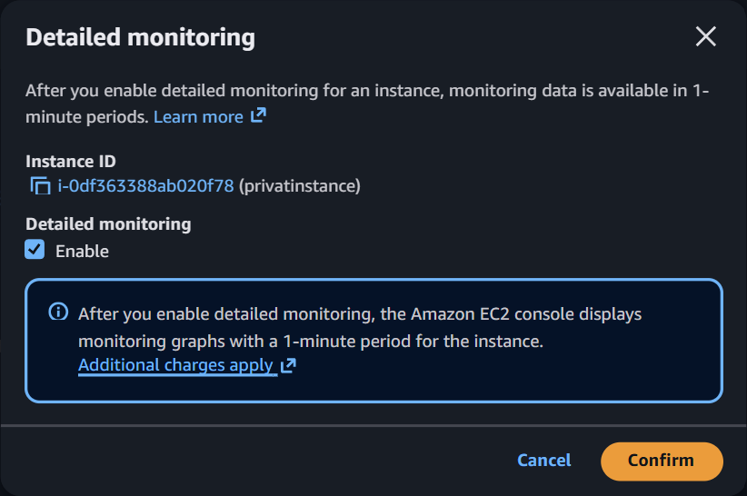{width="5.833333333333333in" height="3.875in"}

*Figur 37*

*EC2 instance list --- accessing Monitor and troubleshoot for detailed
monitoring*

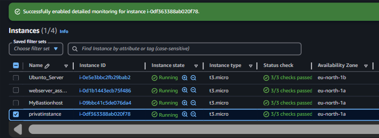{width="5.833333333333333in" height="2.125in"}

'*Figur 38*

*Detailed monitoring enabled --- confirmed across all four running
instances (public EC2, private EC2, bastion, and additional server)*

# 

# Conclusion

This project resulted in a fully segmented custom VPC with distinct
public and private subnets, correct default routing for each (Internet
Gateway for the public subnet, NAT Gateway for the private subnet),
least-privilege Security Groups --- including
Security-Group-to-Security-Group referencing for the bastion host ---
and a bastion-host access path secured with SSH agent forwarding rather
than key copying. Along the way, real issues were diagnosed
methodically: a CIDR overlap during subnet planning, and a \"connection
refused\" on the public instance that was correctly traced to a missing
web server rather than a networking fault, using the timeout-vs-refused
distinction and netcat to confirm it at each layer.
