# Assignment 2 — Application Load Balancer

*Assignment 2 — a common DevOps pattern: two EC2 instances distributed across separate Availability Zones and placed behind an Application Load Balancer (ALB). This assignment builds on the custom VPC created in Assignment 1 and focuses on load balancing, health checks, and correct security-group isolation between the public-facing load balancer and the private application servers.*

## Objective

Deploy two EC2 instances, each in a different Availability Zone, behind an Application Load Balancer. The ALB must handle all incoming HTTP traffic, and the EC2 instances must not be reachable directly from the internet.

### Success criteria for this assignment

- Two EC2 instances launched in the same VPC, in two different Availability Zones, each running a simple web server installed via user data.
- An Application Load Balancer deployed across two public subnets, with an HTTP (port 80) listener and a Target Group containing both EC2 instances.
- A health check configured on the Target Group's root path (/), with both targets reporting Healthy.
- Security groups configured so the ALB accepts HTTP from anywhere, while each EC2 instance accepts HTTP only from the ALB's security group — never directly from the internet.
- Verified load balancing: repeated requests to the ALB's DNS name alternate between both instances.
- (Bonus) A custom Route 53 domain aliased to the ALB, an HTTPS listener using ACM, and an Auto Scaling Group behind the ALB.

## Planning & Architecture

Before creating any resources, the target architecture was sketched out: two EC2 instances in separate Availability Zones, each in its own public subnet, sitting behind an Application Load Balancer that alone is exposed to inbound HTTP traffic from the internet. Building on the custom VPC from Assignment 1, the first instance reuses the existing public subnet in eu-north-1a, while a new public subnet is created in eu-north-1b for the second instance.

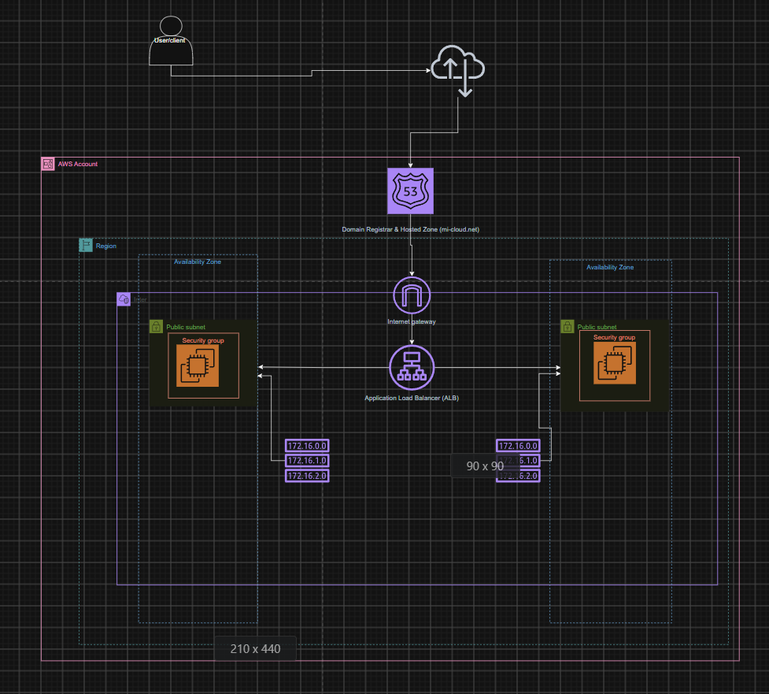

*Figur 0 — Target architecture: two EC2 instances across separate AZs, registered behind an Application Load Balancer.*

## 1. Launching the First EC2 Instance (eu-north-1a)

To place the two instances in different Availability Zones, a second public subnet first had to be created for the eu-north-1b instance, since the existing public subnet from Assignment 1 only covers eu-north-1a. The first instance was launched into that original public subnet.

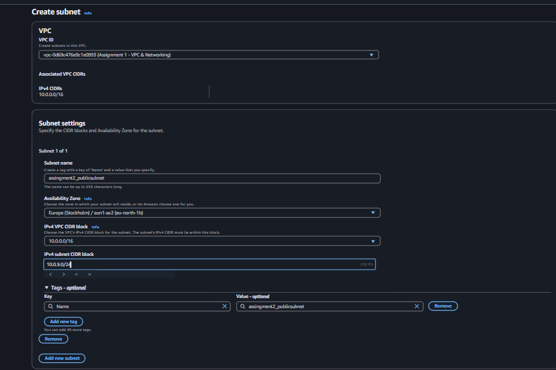

*Figur 1 — Creating a new public subnet for the second instance (eu-north-1b).*

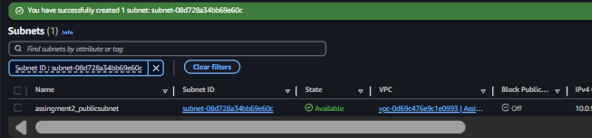

*Figur 2 — Subnet configuration confirmed.*

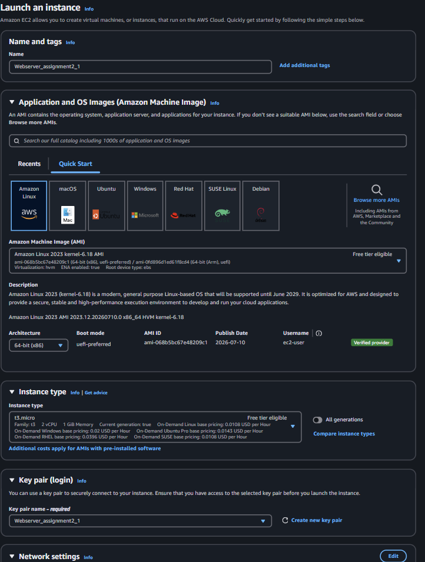

*Figur 3 — Launching the first web server instance into the original public subnet from Assignment 1 (eu-north-1a).*

### 1.1 Security Groups

A standard security group was created for each instance, allowing SSH and HTTP from the administrator's own IP only — one rule for administrative access and one for reaching the web server during setup.

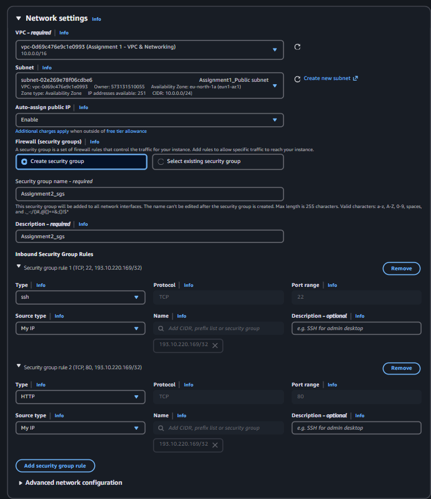

*Figur 4 — Security group allowing SSH and HTTP from the admin's IP.*

### 1.2 User Data — Web Server Automation

A user-data script was used to automatically install and configure the web server on launch: it installs nginx, starts the service, enables it so it survives a reboot or stop/start cycle, and writes the instance's hostname to the default web page so each instance can be told apart during testing.

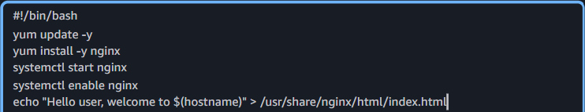

*Figur 5 — User-data script installing and starting nginx, and writing the hostname to the default page.*

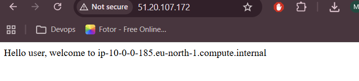

*Figur 6 — Verifying the first web server responds correctly.*

## 2. Launching the Second EC2 Instance (eu-north-1b)

The second instance was launched into the new public subnet created for eu-north-1b, using the same custom VPC as the first instance. A public IP was enabled for initial testing, and a security group with the same SSH/HTTP-from-my-IP rules was attached.

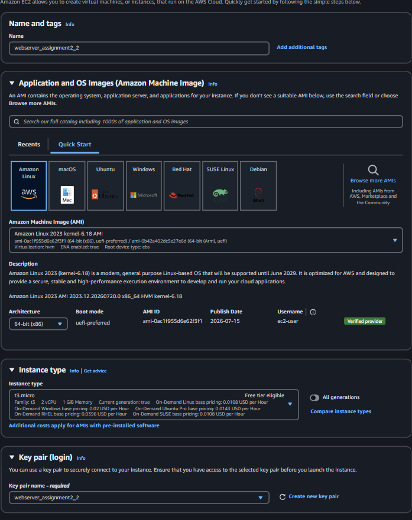

*Figur 7 — Launching the second instance into the eu-north-1b public subnet.*

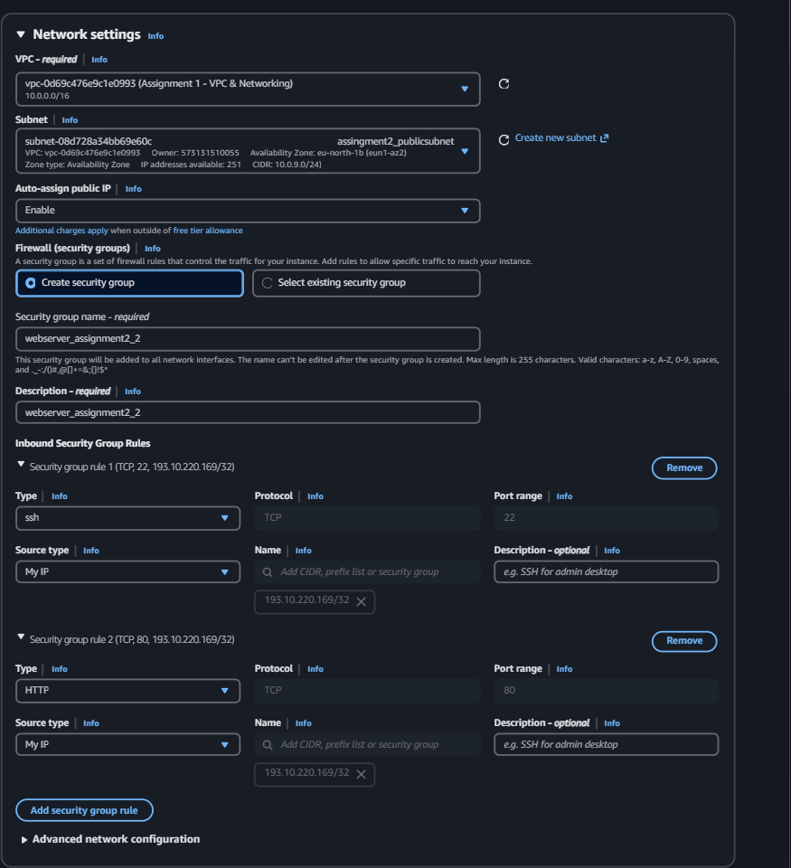

*Figur 8 — Public IP enabled and security group configured for the second instance.*

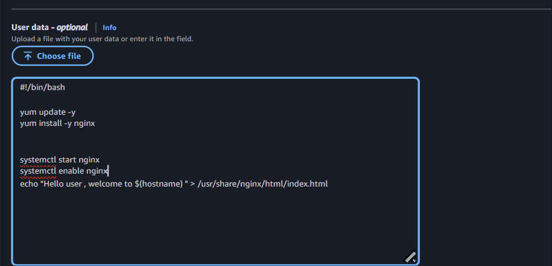

*Figur 9 — The same user-data script applied to the second instance.*

### 2.1 Troubleshooting — Second Instance Unreachable

The second instance did not respond to any request. Since the default NACL allows all traffic, the security groups were checked first and found to be correctly configured.

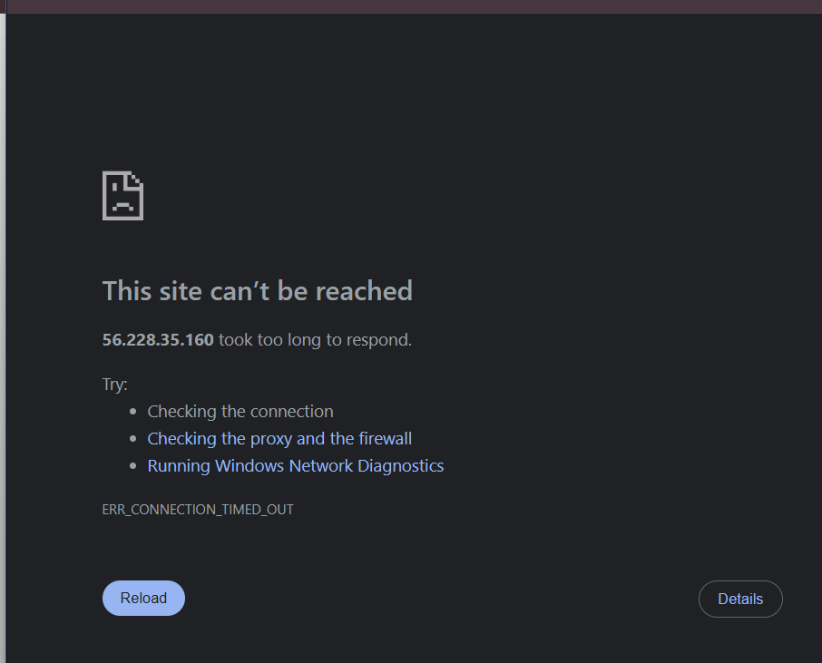

*Figur 10 — Security groups reviewed and confirmed correct.*

The route table for the new subnet was checked next, and this turned out to be the cause: the subnet had no route to the Internet Gateway.

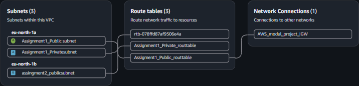

*Figur 11 — Route table for the eu-north-1b subnet, missing a route to the Internet Gateway.*

A dedicated route table was created for the public subnet in eu-north-1b (Assignment 2).

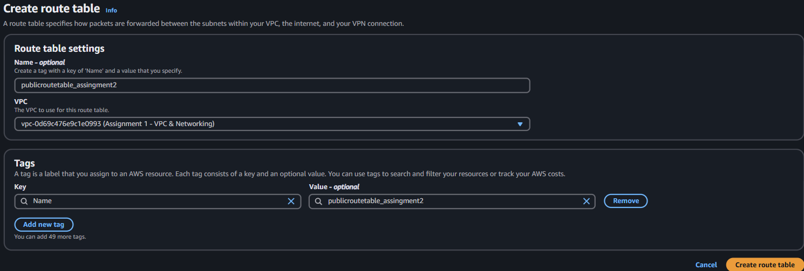

*Figur 12 — Creating a route table for the eu-north-1b public subnet.*

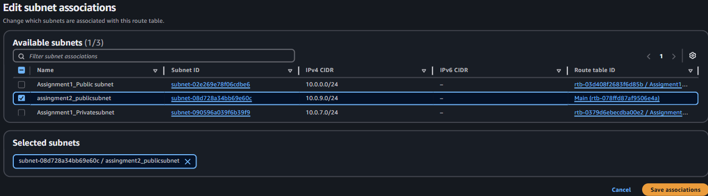

*Figur 13 — Associating the new route table with the eu-north-1b subnet.*

A default route to the Internet Gateway was then added.

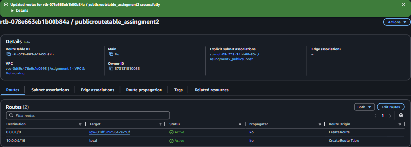

*Figur 14 — Adding the Internet Gateway route to the new route table.*

With the route in place the instance became reachable, but the web server still returned no response, so the instance itself was inspected next.

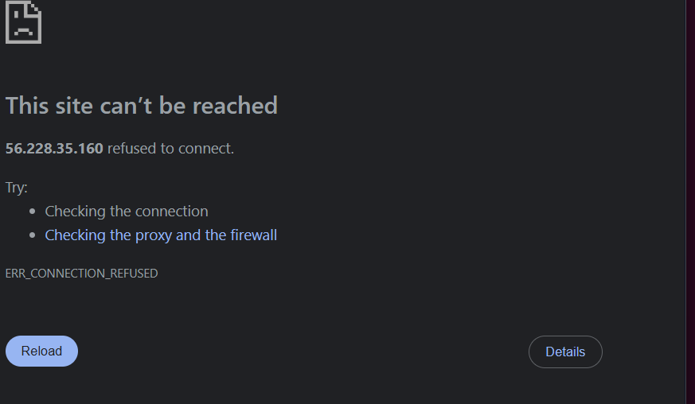

*Figur 15 — Instance reachable, but no web server response.*

The instance logs showed a connectivity failure consistent with the missing internet route at launch time — the instance had no path to the internet when the user-data script tried to run, so the nginx installation never completed. To resolve this, a new instance was launched with the same user-data script, now that the route table was already in place.

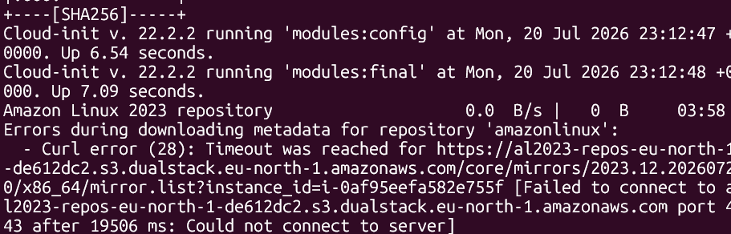

*Figur 16 — Relaunching the second instance now that the route to the internet exists.*

This confirmed the root cause: the first instance's subnet already had a working route to the Internet Gateway, so its user-data script could run without issue, while the second instance's subnet did not have that route yet at launch time, so its user-data script could not reach the internet to install nginx. After relaunching with the route already in place, the second instance came up correctly.

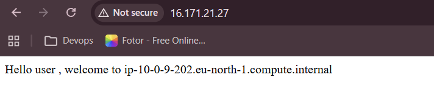

*Figur 17 — Second instance now running correctly after the fix.*

## 3. Setting Up the Application Load Balancer

A dedicated security group was created for the ALB, allowing HTTP from anywhere — since the ALB is the only resource meant to be reachable directly from the internet — placed in the same custom VPC as the EC2 instances.

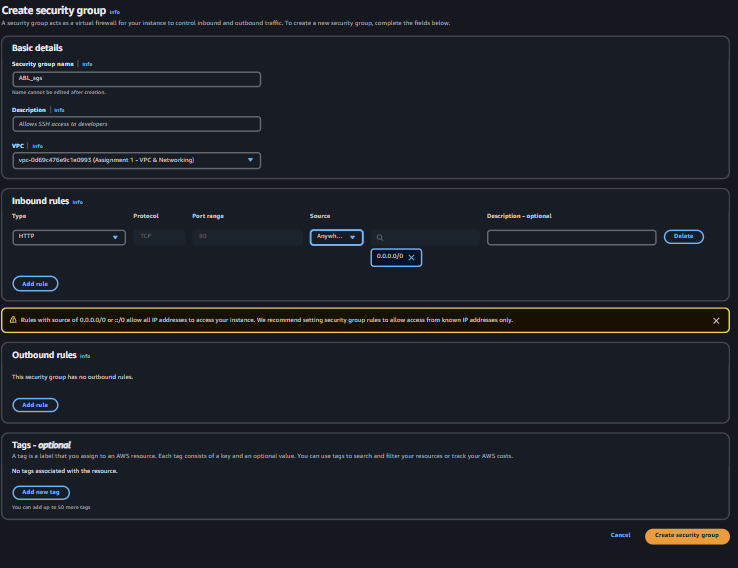

*Figur 18 — Security group for the ALB, allowing HTTP from anywhere.*

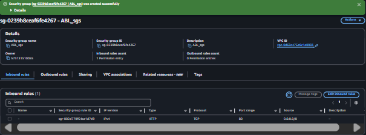

*Figur 19 — ALB security group configuration confirmed.*

### 3.1 Target Group

A Target Group was created with target type Instances, since it needed to point directly at the two EC2 instances, using the HTTP protocol on port 80 to match the traffic from the ALB. IPv4 was chosen as the address type to match the instances' configuration, in the same custom VPC. The health check was configured to use the HTTP protocol against the root path (/), matching where nginx is configured to respond with the default page — confirmed manually by loading that path in a browser. Note that the health check requires a strict 200 response: a 404 or 500 is treated as unhealthy even though it confirms the server itself is reachable.

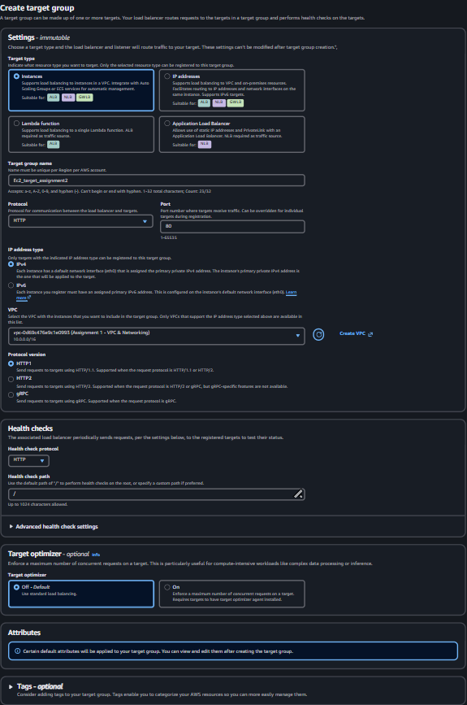

*Figur 20 — Target Group creation: Instances, HTTP:80, health check on the root path.*

### 3.2 Registering Targets

Because the Target Group type was Instances, both EC2 instances were registered directly. An ALB is a regional service that spans Availability Zones, which requires subnets to be deployed in at least two AZs so the ALB can place its nodes there; Target Groups define where the ALB sends traffic, and registering the instances completes that connection.

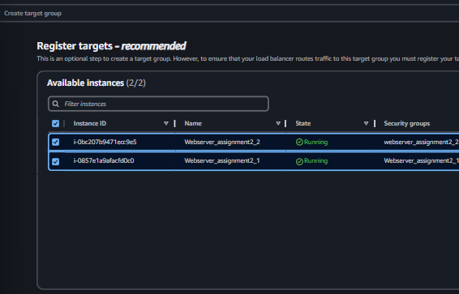

*Figur 21 — Registering both EC2 instances with the Target Group.*

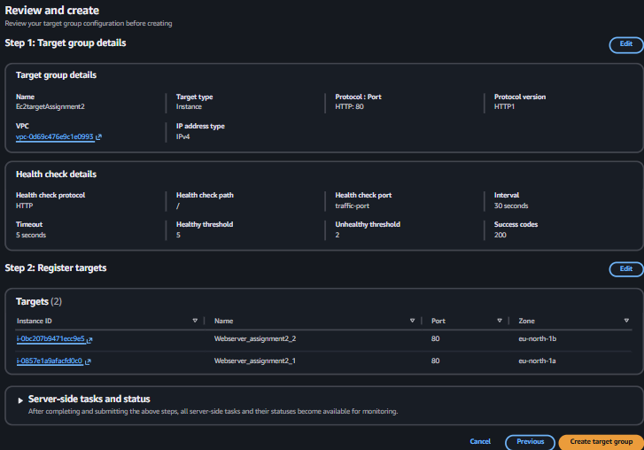

*Figur 22 — Targets registered.*

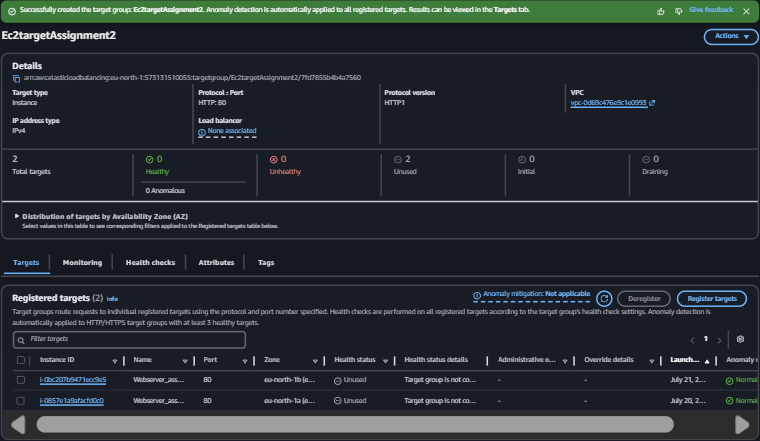

*Figur 23 — Target Group showing both registered instances.*

### 3.3 Creating the Load Balancer

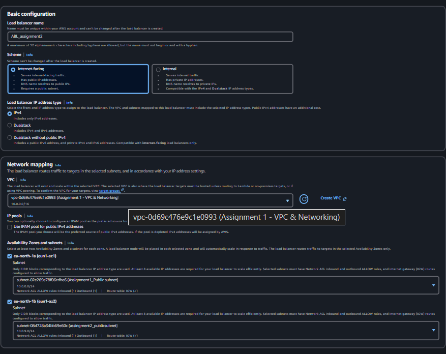

*Figur 24 — ALB configuration summary.*

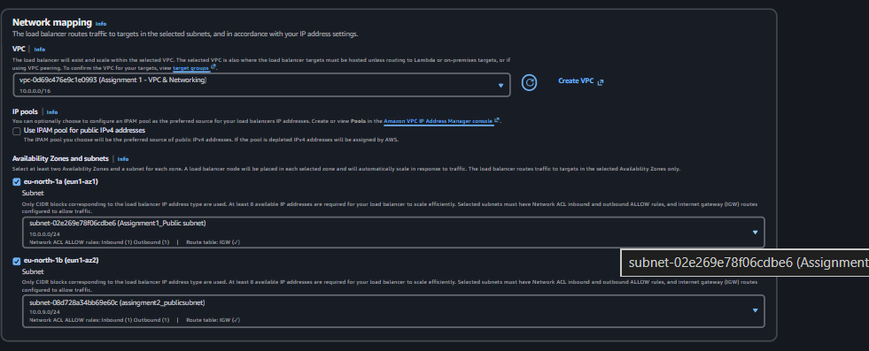

*Figur 25 — Network mapping across the two public subnets in eu-north-1a and eu-north-1b.*

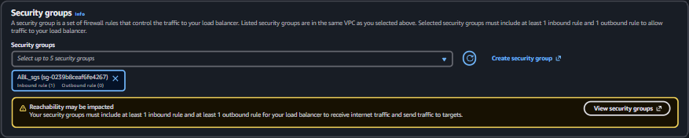

*Figur 26 — Security group attached to the ALB.*

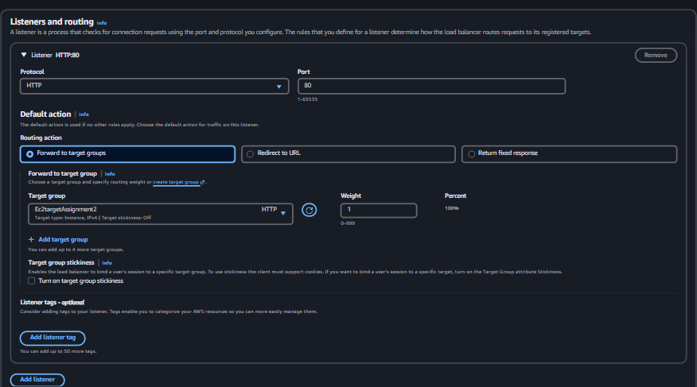

*Figur 27 — Listener and routing configuration.*

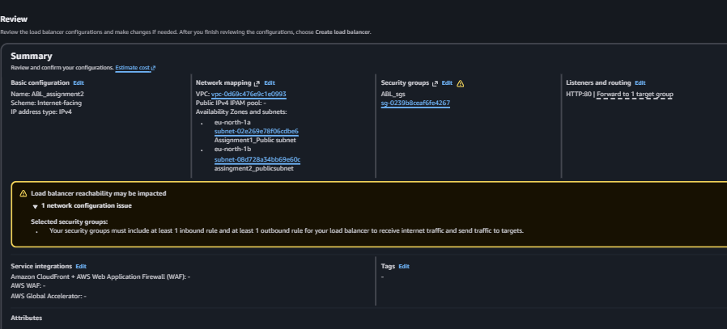

*Figur 28 — Reviewing the ALB configuration before creation.*

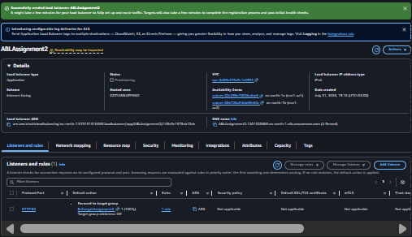

*Figur 29 — ALB created.*

## 4. Restricting EC2 Access to the ALB Only

With the ALB in place, both EC2 security groups were updated to accept traffic only from the ALB's security group, rather than being publicly reachable. Since an existing IP/CIDR rule could not be edited in place to reference a security group instead, the old rule was deleted and replaced with a new one referencing the ALB's security group directly.

*Figur 30 — First instance's security group updated to allow HTTP only from the ALB's security group.*

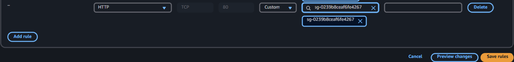

*Figur 31 — The same change applied to the second instance.*

## 5. Testing and Troubleshooting the ALB

Both targets initially showed as Unhealthy in the Target Group, so this was investigated systematically.

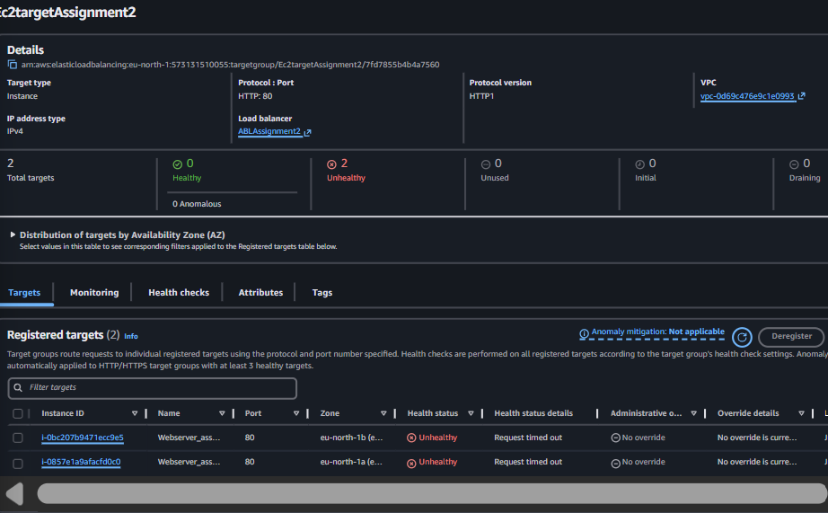

*Figur 32 — Target Group showing both targets as Unhealthy.*

According to AWS documentation, an Unhealthy status means the health check itself is failing, and the checklist is: confirm the instance is running a web server, confirm the health-check path returns a valid 200 response, and confirm the security group permits traffic on port 80.

- Check that the instance is running a web server.
- Check that the health-check path responds with a valid 200 response.
- Check that the instance's security group permits access on port 80 (HTTP).

The instance's security group was temporarily opened to all HTTP traffic to test directly, and curl confirmed the web server was running and returning 200 OK — ruling out the web server itself as the cause.

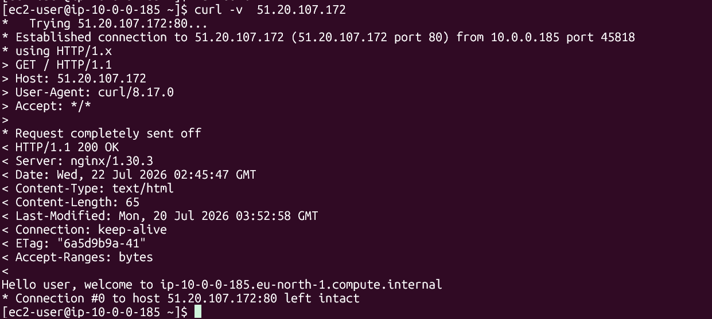

*Figur 33 — Confirming the web server responds with 200 OK via curl.*

Since the server was reachable, the nginx access log was checked next — nginx logs every request, including errors in the 400–500 range. No requests from the ALB's private subnet range (10.0.0.0/24) appeared in the log at all, indicating the ALB's health checks were never reaching the instance. The access log was read using the standard nginx combined log format: `$remote_addr - $remote_user [$time_local] "$request" $status $body_bytes_sent "$http_referer" "$http_user_agent"`.

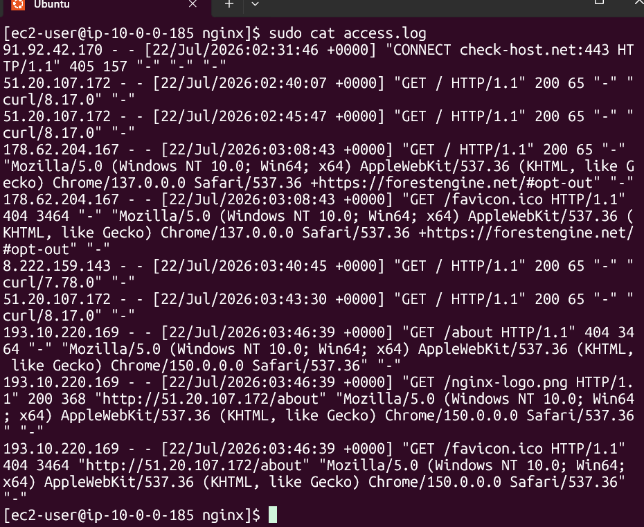

*Figur 34 — nginx access log showing no incoming requests from the ALB.*

With the instance ruled out, attention turned to the ALB's own configuration.

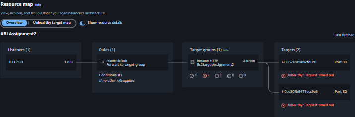

*Figur 35 — Reviewing the ALB's security group rules.*

The problem was an assumption that the ALB's security group had a default allow-all outbound rule — it did not. The Target Group's security group was added as the outbound destination so the ALB's traffic reaches the two EC2 instances directly, rather than being scoped to the whole VPC's 10.0.0.0/16 range.

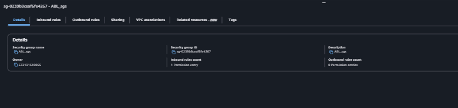

*Figur 36 — Missing outbound rule identified on the ALB's security group.*

After adding the outbound rule, the nginx access logs confirmed the ALB's health checks were now reaching the instances.

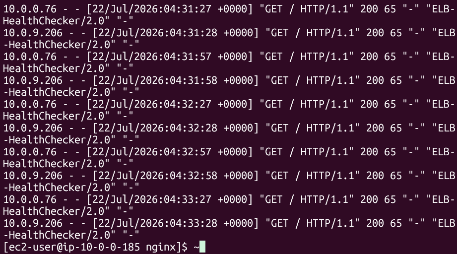

*Figur 37 — Access logs now showing incoming health-check requests from the ALB.*

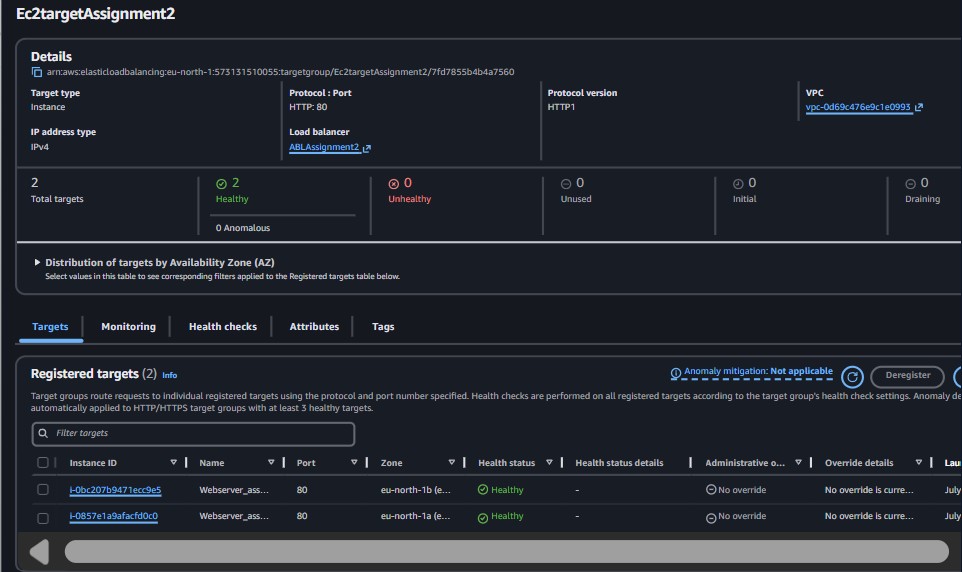

*Figur 38 — Both targets reporting Healthy in the Target Group.*

Once both instances were confirmed healthy, the temporary security-group rule that made them publicly accessible was removed, restoring the intended design where the instances are reachable only through the ALB.

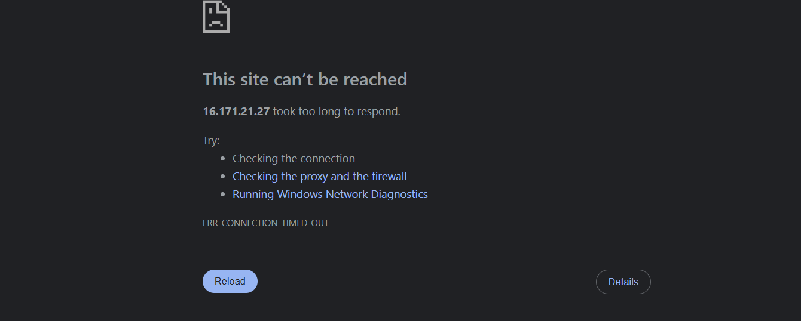

*Figur 39 — Temporary public-access rule removed from the EC2 security groups.*

## 6. Verifying Load Balancing Across Both Instances

With both targets healthy, the ALB's DNS name was tested to confirm traffic is distributed across both Availability Zones.

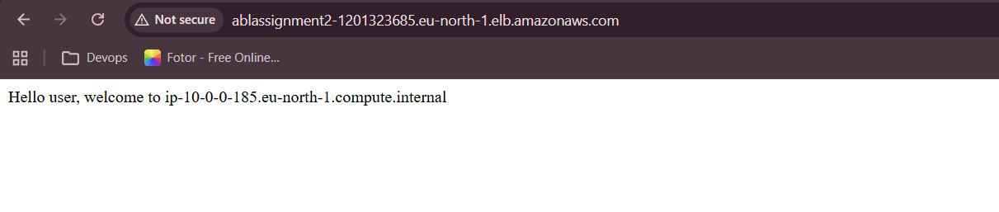

*Figur 40 — Requests through the ALB reaching the first instance (eu-north-1a, 10.0.0.0/24).*

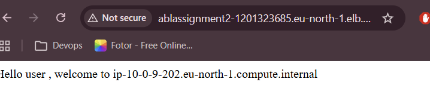

*Figur 41 — Requests through the ALB reaching the second instance (eu-north-1b, 10.0.9.0/24).*

## 7. Bonus — Custom Domain with Route 53

The ALB's default DNS name was functional but too long to give to end users, so a custom domain was set up as the root domain instead. A domain was purchased — mi-cloud.uk — since it was the cheapest option available under the desired name.

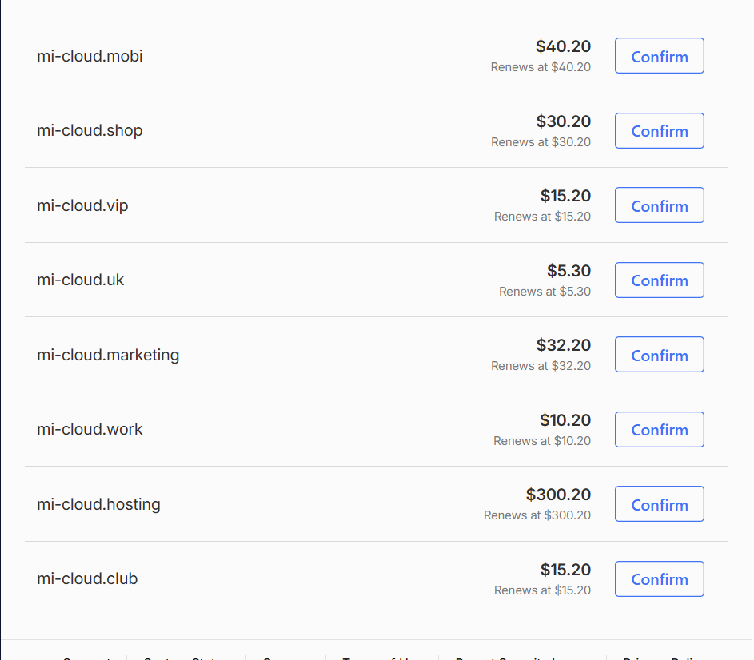

*Figur 42 — Purchasing the mi-cloud.uk domain.*

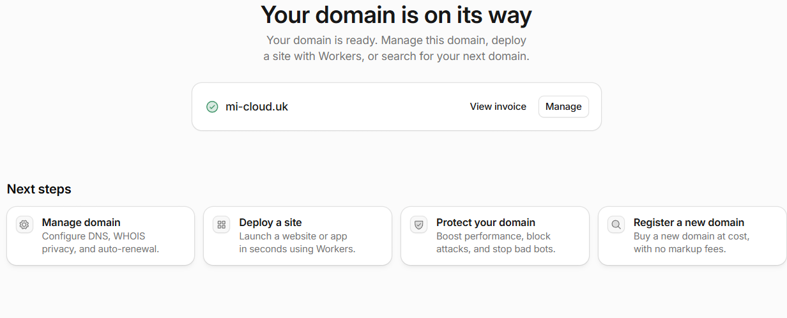

*Figur 43 — Domain purchase confirmed.*

### 7.1 Hosted Zone

Since the default hosted zone created by the domain registrar could not be edited directly for this purpose, a new public hosted zone was created manually to hold the DNS records for the domain.

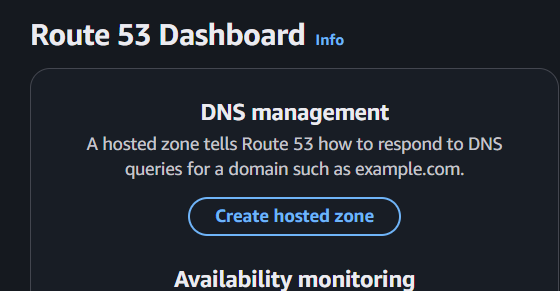

*Figur 44 — Creating a public hosted zone.*

A hosted zone acts as the container holding all the DNS information needed to route traffic to a domain. The original domain name (purchased through Cloudflare) was used, with the Public type selected since the domain needed to be resolvable from the internet, and a memorable tag applied.

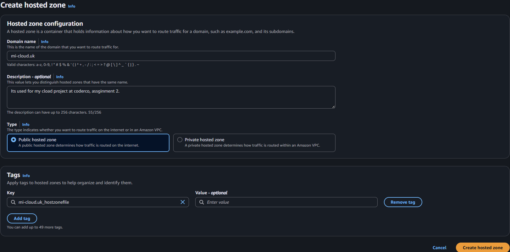

*Figur 45 — Hosted zone configuration.*

AWS created the hosted zone along with an SOA (Start of Authority) record, which holds metadata about the zone — including when other name servers should refresh and how the zone is managed.

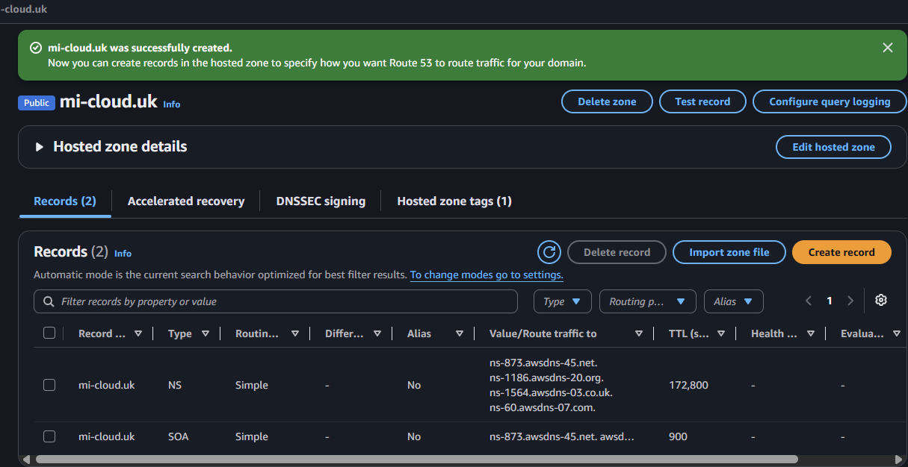

*Figur 46 — Hosted zone created with its default SOA record.*

### 7.2 Alias Record

An A record was created with the Alias option enabled, since the ALB already has its own AWS-managed DNS name — an alias lets the purchased domain point to that existing DNS name rather than requiring a separate IP address. The alias target was set to the ALB, in the same region the ALB was created in, since ALBs are a regional service. A Simple routing policy was used, since the goal was to route to a single resource, and no subdomain name was entered because the intent was to alias the root domain itself to the ALB.

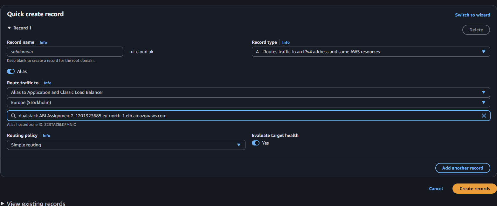

*Figur 47 — Creating the alias A record pointing to the ALB.*

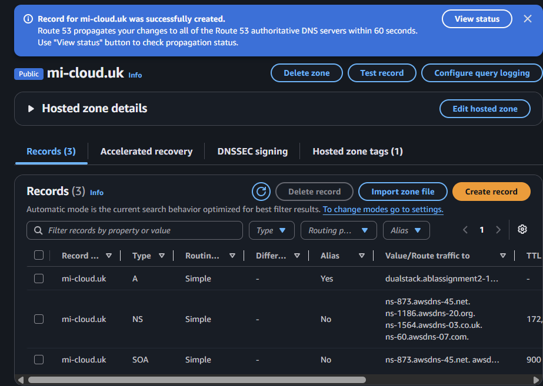

*Figur 48 — Alias record created.*

### 7.3 Name Server Registration

The final step was registering the hosted zone's name servers with the domain's registrar. This hit a limitation in Cloudflare: the registrar's auto-assigned name servers could not be changed without transferring the domain to a third-party registrar.

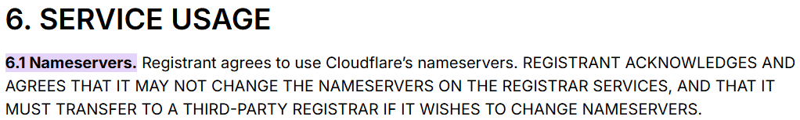

*Figur 49 — Cloudflare does not allow changing the domain's name servers directly.*

A CNAME-based workaround was considered but would have defeated the purpose of the exercise, so the domain was instead re-purchased directly through Route 53.

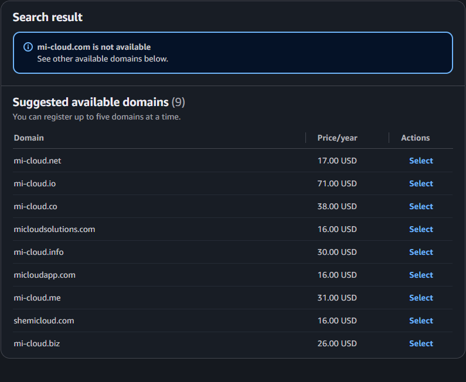

*Figur 50 — Purchasing the domain directly through Route 53.*

Route 53 automatically created a new hosted zone for the domain once purchased, and the old Cloudflare-linked hosted zone was deleted since it was no longer needed.

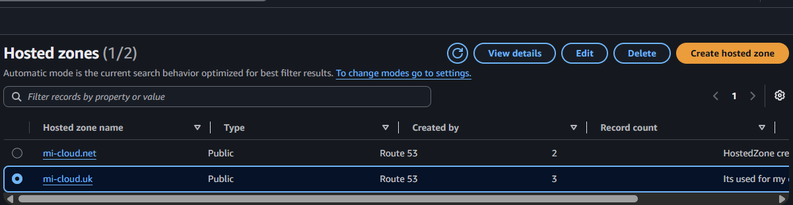

*Figur 51 — New hosted zone automatically created for the Route 53-registered domain.*

The alias record for the official domain was then recreated in the new hosted zone.

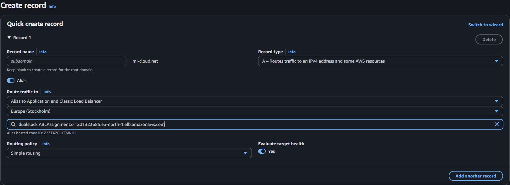

*Figur 52 — Alias record created for the official domain in Route 53.*

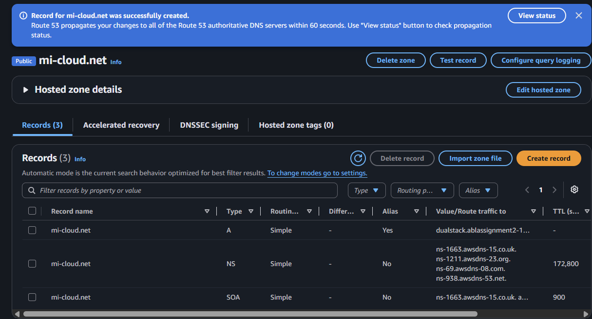

*Figur 53 — Record confirmed in the hosted zone.*

### 7.4 Verifying the Custom Domain

The domain did not resolve correctly on the first attempt, so this was investigated further.

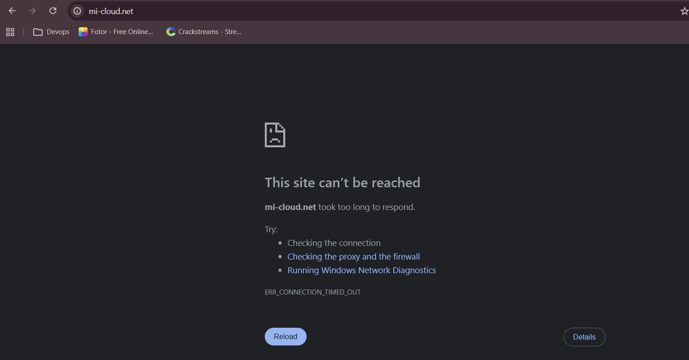

*Figur 54 — Initial test of the custom domain failing.*

DNS troubleshooting tools showed no errors and returned answers from both ALB nodes across the two Availability Zones, ruling out DNS resolution as the cause.

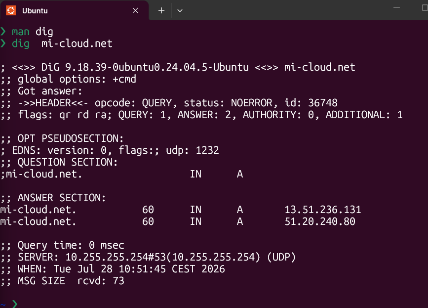

*Figur 55 — DNS lookup confirming correct answers from both Availability Zones.*

The browser reported a connection timeout, suggesting the request was being blocked rather than simply failing to resolve. Testing the same URL with curl revealed the actual cause: the browser was defaulting to HTTPS, which the ALB's listener does not handle, while HTTP was the expected protocol. Switching the URL to HTTP resolved the issue.

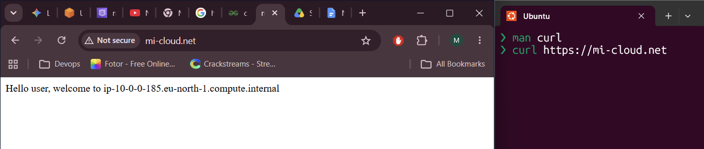

*Figur 56 — Identifying the HTTPS-vs-HTTP mismatch using curl.*

*Figur 57 — Custom domain successfully resolving over HTTP.*

## Conclusion

This project resulted in two EC2 instances, deployed across separate Availability Zones, running behind an Application Load Balancer that alone is exposed to the internet. Health checks confirm both targets as healthy, and repeated requests to the ALB's DNS name correctly alternate between the two instances, confirming load balancing across zones. Security groups were tightened so that each EC2 instance accepts HTTP only from the ALB's security group rather than from the internet directly. As a bonus, a custom domain was registered and aliased to the ALB through Route 53, replacing the long default AWS DNS name. Along the way, several real issues were diagnosed methodically: a missing route-table entry that left the second subnet without internet access at launch, a missing outbound rule on the ALB's security group that silently blocked health checks, and a browser-default HTTPS request against an HTTP-only listener that was traced using curl.
